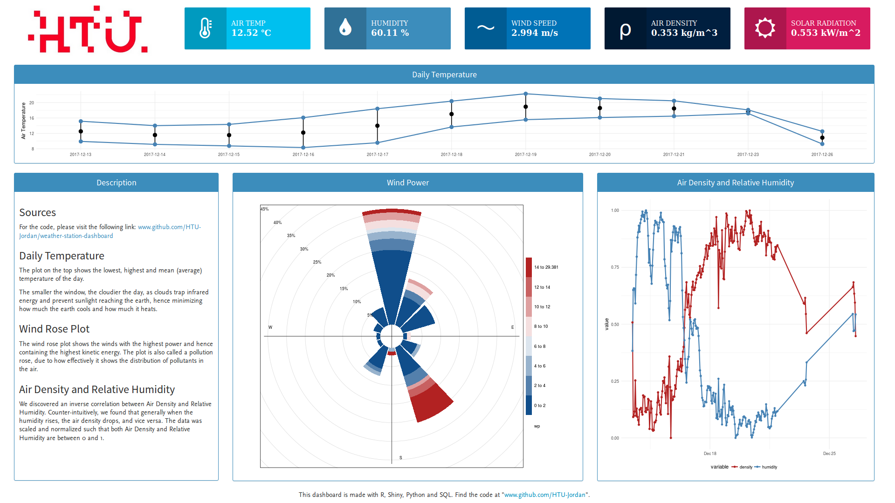

# Weather Station Dashboard

## Overview
We have a weather station atop the main building at HTU. We decided to take the data feed and create a simple real-time / pseudo real-time dashboard that represents the data in an intuitive way and gives insight into our weather conditions.

__Note:__ All IP addresses, database users and passwords have been replaced with * for security purposes.

## Technologies

- __R__ for data analyses and visualizations
- __Shiny__ for dashboard Server logic and UI
- __HTML__ for design
- __CSS__ for design
- __Python__ for initializing and updating the database
- __SQL__ for database
- __LoggerNet (CRBasic)__ for the weather station connection

## Folder Structure
Stylesheet, logo, font and footer files are place in the `www` folder. Shiny readily accepts them in this directory.

## Data Pipeline
The weather station outputs 3 comma-separated tables.   
1. `CR1000_FifteenSec.dat` - A single entry that gets replaced every 15 seconds due to storage constraints.  
2. `CR1000_OneMin.dat` - Readings every minute.  
3. `CR1000_OneHour.dat` - Readings every hour.  

The new entries in these tables (except the 15 Second table) are appended to a MS-SQL database called `weatherDB` with tables called `perMINUTE` and `perHOUR` respectively.  

Then our dashboard connects to the database and the 15 Second Table and reads a specified number of rows from each to process and display.

## Source Code Explanation
- `loggernet-config.CR1`  
Configuration file/program for the weather station.  

- `global.R`  
Contains static logic for the dashboard as well as library imports.

- `app.R`  
Main dashboard source file, contains all UI and Server logic.

- `ws_db.sql`    
Creates database schema.

- `init_weatherDB.py`  
Populate the database for the first time.

- `update_min_weatherDB.py`  
Update the database (table = perMINUTE) on change in output tables from weather station.

- `update_hour_weatherDB.py`  
Update the database (table = perHOUR) on change in output tables from weather station.

- `update_min_weatherDB.bat`  
Call `update_min_weatherDB.py` from windows task scheduler.

- `update_hour_weatherDB.bat`  
Call `update_hour_weatherDB.py` from windows task scheduler.

- `run_dashboard.sh`, and `run_db script.sh`   
Linux scripts to run the dashboard by broadcasting to an IP address and run the database update script

- `www\style.css`  
CSS design stylesheet for the dashboard.

## Difficulties and Obstacles  
To be written...  
